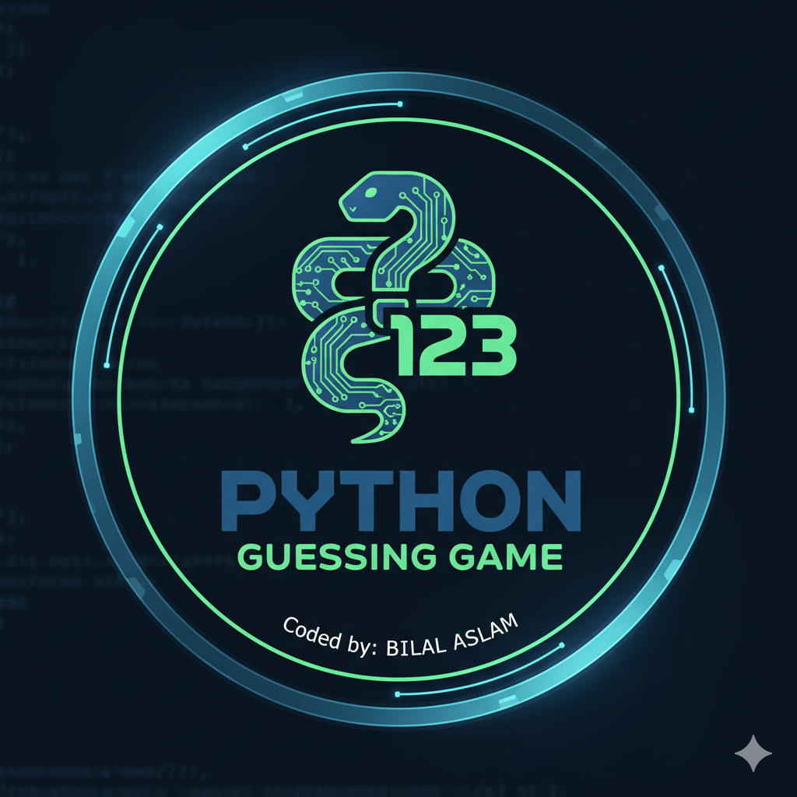

<p align="center">
  
</p>

<h1 align="center">Number Guessing Game</h1>

<p align="center">
  
  
  
  
</p>

---

## Overview

A simple Python command-line game where the computer chooses a random number between `1` and `100`, and the player keeps guessing until the correct number is found.

The project also stores the best score in `Hi-score.txt`, so the player can try to beat their lowest attempt count.

---

## Features

| Feature | Detail |
|---|---|
| Random number | Uses `random.randint(1, 100)` |
| Input validation | Rejects invalid and out-of-range guesses |
| Hint system | Tells the player to guess higher or lower |
| Attempt counter | Counts total guesses |
| High score | Saves the lowest attempt count in `Hi-score.txt` |
| Beginner friendly | Good practice for loops, files, functions, and conditions |

---

## Project Structure

```text
Number-guessing-game/
|-- Number-guessing-game.py
|-- Hi-score.txt
|-- logo1.png
|-- LICENSE
`-- README.md
```

---

## How To Run

```bash
git clone https://github.com/bilal-dev-0x/Number-guessing-game.git
cd Number-guessing-game
python Number-guessing-game.py
```

---

## Example Output

```text
Welcome to the Number Guessing Game!
I have selected a number between 1 and 100.
Guess the number (1-100): 50
Higher number, please.
Guess the number (1-100): 75
Lower number, please.
Guess the number (1-100): 63
You guessed the correct number in 3 attempts.
Incredible! You guessed it in very few attempts.
New high score: 3
```

---

## Concepts Practiced

- `random.randint()`
- `while` loops
- `try` / `except` input handling
- Functions
- Conditional logic
- File reading and writing
- Simple game state management

---

## Future Improvements

- Add difficulty levels.
- Add replay without restarting the script.
- Add a scoreboard with dates.
- Convert the game into a small GUI app.

---

<p align="center">
  <b>A clean beginner Python game focused on logic, loops, and file handling.</b>
</p>
